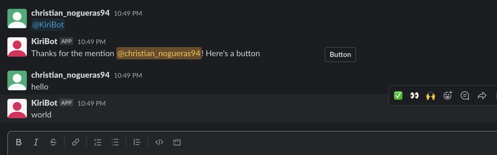

# Slackbot template App

Slack bot template include "hello world" code for creating a slackbot.The idea behind the template is to make it easy to clone the project and create new Slack Bots quickly. 

To learn more about it, check out this [blog post](https://slack.com/intl/en-ie/blog/developers/sharpen-development-skills-tasks-app) from [slack](https://slack.com) or watch this series of videos on [YouTube](https://youtube.com/playlist?list=PLWlXaxtQ7fUb0B4uNTKirvrQ0JOTCBFae) also from slack.

If you want to see the app in action, refer to the screenshots below



## Features

- Write in a public channel and the bot will respond.
    - You can write "hello" in the public channel, and the bot will respond with "world."
- Respond to mentions of the bot.
    - If you mention the bot, it will greet you with your Slack username.

## App code

- [Setup](./docs/setup.md)
- [Project structure](./docs/structure.md)


## Slack App Configuration

The template includes a manifest.yml file that already includes the necessary configurations and permissions for creating a Slack App in your Workspace. The communication between the Slack Bot and Slack Workspace is achieved through websockets, and no further URL or configuration is required in the Slack API web page. The necessary configurations and permissions are included in the manifest.yml file, so with this in place, you should have all the necessary configurations set up.

## Setting up the Slack App Tokens

After creating a new Slack App, go back to Visual Studio Code and create a new .env file. The file should include the following:

```shell
SLACK_BOT_TOKEN
SLACK_APP_TOKEN
```
You can obtain the SLACK_BOT_TOKEN from the `OAuth & Permissions` section and the SLACK_APP_TOKEN from the `Basic Information` section in the App Level Tokens. 

The SLACK_BOT_TOKEN is used for the Slack Bot to access the Slack API and respond to events, while the SLACK_APP_TOKEN is used for websocket communication between the Slack Bot and Slack Workspace.

## Running the Slack Bot

To run the Slack Bot, you need to run the following commands in the terminal:

```shell
npm install
npm start
```

If everything is set up correctly, you should see a log in the terminal indicating that the Slack Bot is running, and no errors should appear on the screen.

## Testing the Slack Bot

To test the Slack Bot, you need to install the Slack App in your Slack Workspace. After installing the Slack App in your Workspace, you need to invite the bot to a public channel. Then, write "hello" in the channel, and the bot should respond with "world."


